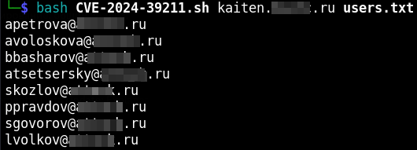

# CVE-2024-39211 (Kaiten User Enumeration)
[Kaiten](https://kaiten.ru/) - a workflow management system, is vulnerable to unrestricted brute force attacks on user logins and email addresses registered in the system via a simple POST request.

_Discovered by [Tom Hunter](https://tomhunter.ru/)_

Links:

[CVE MITRE Description](https://cve.mitre.org/cgi-bin/cvename.cgi?name=CVE-2024-39211)

[NVD CVE](https://nvd.nist.gov/vuln/detail/CVE-2024-39211)

## Usage
Simple download bash script and run with custom wordlists _(only login, not e-mails!)_
```bash
bash CVE-2024-39211.sh <input.domain.ru> <wordlists_users>
```
As Result:



## Wordlists
Companies often use login policies based on combinations of first and last names, for example, Anton Ivanov = aivanov or a_ivanov. Accordingly, below are links to a large set of Russian names and surnames:
- [Russian top names](https://github.com/sorokinpf/russian_names/blob/master/russian_trans_names.txt)
- [Russian top Surnames (100k lines)](https://github.com/sorokinpf/russian_names/blob/master/russian_trans_surnames.txt)

This repository contains archive of wordlist with a basic set of 2.5 million combinations of the form `aivanov`.

## Mitigation
- Update Kaiten software to last version
- Implement basic CAPTCHA or rate limits
- Do not send error-based responses (fix yourself)
